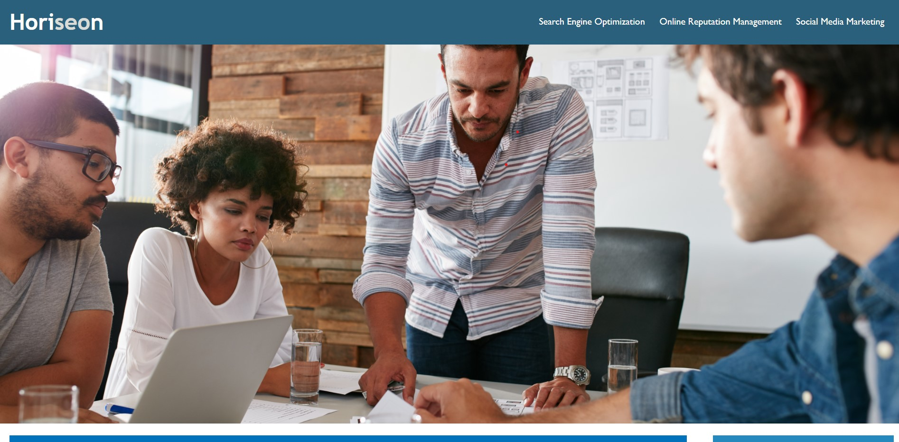
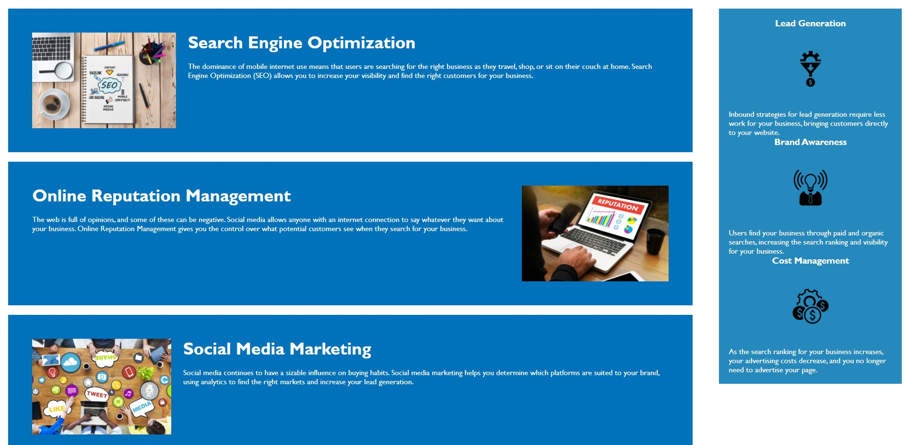

# Code Refactor Starter Code

# First Coding Challenge

# Horiseon, a social solution services company needed help refactoring a website with a focus on accesibility.

## Changed titles to reflect web page

## Corrected a broken link for navigation.

## Cleaned up CSS making more logical paths and condensed selectors for more concise code.

## Made page more accesible by adding Alt Attributes to photos.

## Updated for more accurate elements and get rid of unnecesary classes.

## Added comments throughout HTML and CSS to assist with collaboration.

